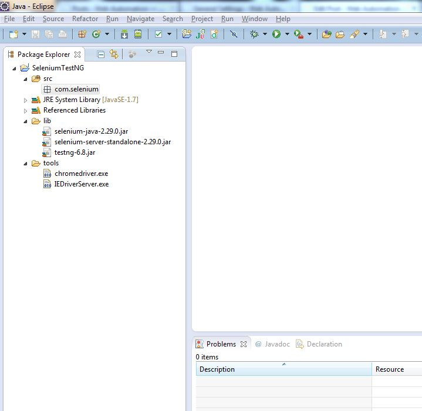

# 1.4 Eclipse Project setup

We assume in this tutorial that all the required tools are downloaded to your system. In order to setup your automation project in eclipse please follow the below steps.

**Step 1:**

Open your eclipse IDE and create a **JAVA** Project \(File &gt; New &gt; Java Project\) if the java Project option doesn’t appear click on other.. and search for java project. Give a name to the project and click Finish.

**Step 2:**

Create a folder with name “lib” \(Right click project Name &gt; New &gt; Folder\).

**Step 3:**

Copy the below mentioned jar files in the lib folder. The version numbers may change for the mentioned JAR files. You can copy the files directly into the eclipse folder or else copy to the actual directory and then refresh the project.

1. selenium-server-standalone-2.29.0
2. selenium-java-2.29.0
3. testng-6.8

**Step 4:**

Add the copied jars to the build path: \[Right click Project Name &gt; Click Build Path &gt; Click Configure Build Path &gt; Select libraries tab &gt; Click Add JARs.. &gt; Expand the project name to reveal lib folder &gt; select all the JARs in lib folder &gt; Click OK &gt; Click OK once more to close the window.

**Step 5:**

Create a folder named tools at the project root directory.

**Step 6:**

If downloaded copy the below mentioned executable files into the tools directory.

1. IEDriverServer
2. chromedriver

**Step 7:**

Download testNG plugins into eclipse: Click Help on menu bar &gt; Install New Software &gt; Paste this URL \([http://beust.com/eclipse](http://beust.com/eclipse)\) in the provided textbox. &gt; testNG should appear for download &gt; Click Next and finish the process of Installation. Please note internet should be accessible via Eclipse to do this. In case of issues check internet settings under &gt; Window &gt; preferences &gt; General &gt; Network Connections.. Refer the below screenshot to get an idea.

**Step 8:**

Create a package with name “com.selenium” or any suitable name: Right click src &gt; New &gt; package. We will store our scripts in this package. Final View of our project must look as below.

**Step 9:**Once the project is setup as per the steps above, you are ready to start working with selenium scripts. Follow [Simple testNG Class](https://nsaikiran.gitbooks.io/seleniumautomation/content/sample-testng-class.html) tutorial to get started.

